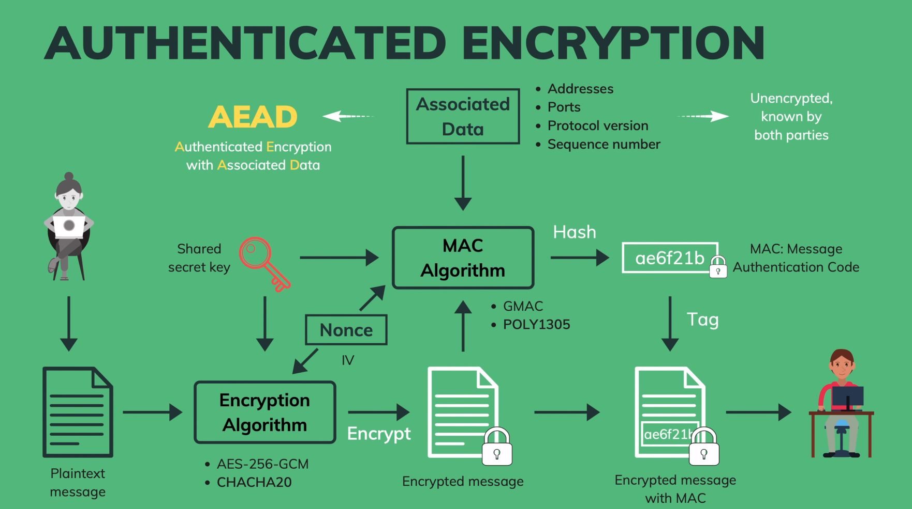
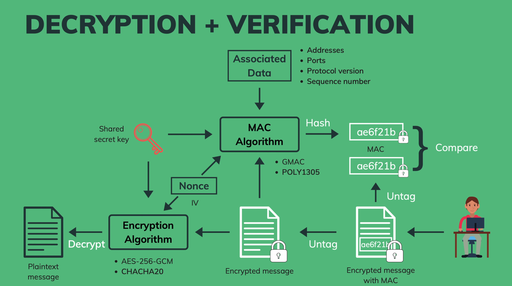
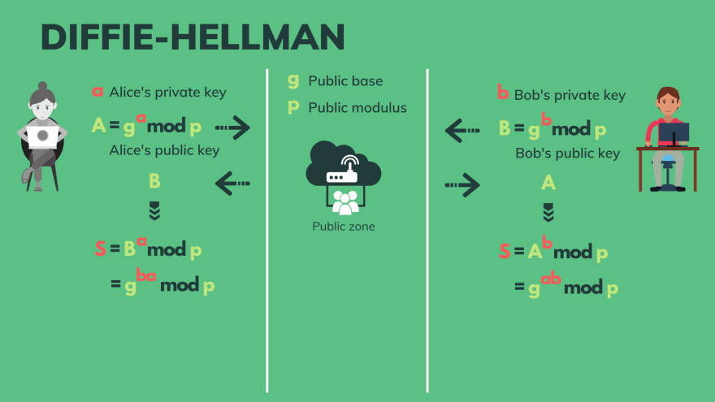

# SSL/TLS概述
`SSL/TLS`是`HTTP`的加密协议。本篇会围绕以下内容讲解

|                                                |                           |
| ---------------------------------------------- | ------------------------- |
| Handshake                                      | (握手)                    |
| Symmetric cryptography                         | (对称密钥)                |
| Asymmetric cryptography                        | (非对称密钥)              |
| Elliptic-curve cryptography                    | (椭圆曲线密钥)            |
| Digital certificates                           | (数字证书)                |
| Certificate authority                          | (证书颁发)                |
| Digital signature                              | (数字签名)                |
| Diffie Hellman                                 | (迪菲-赫尔曼密钥交换算法) |
| Message authentication code                    | (消息验证码)              |
| Bit-flipping attack                            | (字节翻转攻击)            |
| Quantum-computing attack                       | (量子计算攻击)            |
| HKDF (HMAC-based KDF(key derivation function)) | (于HMAC的密钥推导函数)    |
| 0-RTT                                          |                           |
| AEAD                                           |                           |

## SSL / TLS
- SSL (secure Socket Layer) 安全套接层是TLS的前身

- TLS 全称 (transport layer security) 安全网络传输协议

## TLS 的作用
- `website` 的 `HTTPS` 
  -  `HTTP + TLS`
- `Email` 的 `SMTPS`
  - `SMPT + TLS`
- 文件传输 `file transfer` 的 `FTPS`
  - `FTP + TLS`

TLS 提供了？
- 认证 `Authentication`
  - 使用非对称密钥来验证访问者身份。
- 保密 `Confidentiality`
  - 用对称密钥保护在未经认证的访问过程中交换的数据。
- 可靠 `integrity `
  - 使用消息验证码机制保护数据

## TLS 的运作机制
- 握手协议 （认证）
  - 客户端和服务端统一`TLS`协议版本
  - 选择一个密钥算法：一个密钥套件
  - 使用非对称密钥进行认证
  - 使用对称密钥需要建一个`secret key`。
- 记录协议 (保密，可靠)
  - 使用 `secret key` 加密消息并发送
  - 使用 `secret key` 解密收到的消息
  - 验证消息没有被修改

## 为什么既有对称密钥算法，又有非对称密钥算法
- 对称密钥算法不能用来认证。
  - 客户端和服务端都有一个secret key，仅凭secret key难以判断双方的身份。
  - 双方如何生成secret key？如果将secret key暴露，认证本身也不再安全。
- 非对称密钥算法的效率低下，不适合批量加密
  - 和对称密钥相比，慢了100-1000倍
  
## 对称密钥算法
我们都知道，对称密钥算法要求双方事先共享secret key，消息发送者使用secret key加密，消息接收者使用secret key解密，这样即使消息在网络上被黑客截获，他也不知道消息的内容。
- bit-flipping 字节翻转攻击
  - 黑客可以截获对称密钥算法加密的消息，并将消息（二进制）中的1，0互换，篡改消息内容，再发送出去。如果发生在银行交易业务中，这将很危险。
  - 应对方法：认证加密。（如下图）
  
    ### 加密流程
  
  - 1.加密
    - 使用一个加密算法将消息加密，该加密算法还会采取secret key和一个随机数（或者一个初始化向量（IV））作为输入。
  - 2.身份认证
    - MAC （GMAC/POLY1305）将加密的消息再进行一次加密，同样也会带上上一步的secret key和随机数或者IV.
      - MAC算法类似加密哈希函数，输出的是MAC或者消息身份验证码
      - MAC会标记在加密消息上，然后一同发送给接收者。MAC因此也被叫做身份验证标签。
  - 另外
    - TLS 1.3中， 会有一些相关数据需要验证，比如地址，端口，版本协议，序列号等。这些数据不会被加密，而且通信双方都知道。
    ### 解密流程
    
    其实就是加密的反过程。

    只是接收者拿到加密消息会先获取附加在上面的MAC,再通过MAC解密获得另一个的MAC。如果两个MAC不同，说明数据经过修改。
# secret key 怎么交换的？ - 密钥交换算法
对称算法中扮演至关重要的secret key是怎么做到交换的？我们不可以将它泄露到公共网络，不然加密算法将毫无意义。
- 使用 非对称算法 或者 公钥
  - 迪菲-赫尔曼(Diffie-Hellman Ephemerol) DHE
  - 椭圆曲线迪菲-赫尔曼 (Elliptic Curve Diffie-Hellman) ECDHE
  
迪菲-赫尔曼工作流程

- 1. 首先 `Alice` 和 `Bob` 双方会共同认定两个数`g`（base） 和 `p` (mod)
- 2. 双方都会选一个私有数，比如 `Alice` 的 `a` 和 `Bob` 的 `b`
- 3. 他们都会通过如下公式运算得到的数发送给对方
  ```
  A = (g^a) mod p
  B = (g^b) mod p
  ```
- 4. 双方收到后，再进行相同的运算, 最后得到的数是相同的
  ```
  S = (B^a) mod p
  S = (A^b) mod p
  ```
我们可以通过简单的计算来验证上面说的现象
```
(B^a) mod p = (g^b)^a mod p = ( g^(b*a) ) mod p
(A^b) mod p = (g^a)^b mod p = ( g^(a*b) ) mod p
```

## 衍生功能 KDF
