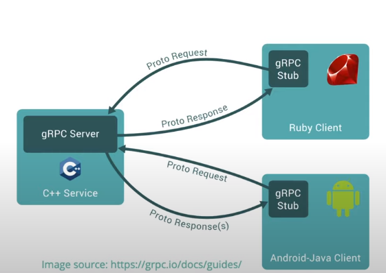

# motivation of gRPC(意义)

- 不同编程语言的通信
    - 维持前后端的通信
    - 微服务可能是用多种语言共同编写完成的
    - 一个一致的信息交换API协议
        - 通信通道（communication channel）：REST,SOAP,message queue
        - 认证机制（authentication mechanism）:Basic, OAuth, JWT
        - 负载格式（payload format）：JSON, XML, binary
        - 数据模式（Data model）
        - 错误处理(Error handling)
    
- 高效地通信 
    即 轻量、快速
    - 微服务之间的数据交换量之庞大
    - 移动网络受到有限带宽的限制
    
- 简单地通信 
    - 客户端和服务器处理核心的逻辑    
    - 剩下的交给框架来处理
    
# gRPC(Romote Procedure Call)
- gRPC 的工作模式
  - 客户端生成stub，来提供和服务端一样的方法
  - stub调用gRPC,通过网络交换信息

# gRPC的实现

## 1.protocol buffer
将多种语言的代码转化成protobuf的格式。
10种官方支持的语言：
- 纯实现：Go, Java, NodeJS
- 以C-gRPC为内核的：C/C++, C#, Objective-C, Python, Ruby, Dart, PHP

## 2.HTTP/2
gRPC 使用HTTP/2来转换protocol
- 二进制框架
- 使用HPACK进行报头压缩
- 多路复用
  - 在一个TPC连接上，并行发送多个请求与响应
  - 低延迟，高利用率
- 服务推送
  - 一个客户端请求，多个响应
  - 降低频繁的往返带来的延迟
  - 
### 
 HTTP/2 VS HTTP/1.1 
  
| | HTTP/2 | HTTP/1.1 |
|--|--|--|
|PROTOCOL|二进制 | 文本|
|报头|压缩的|原文本|
|多路复用|可以|不可以|
|单连接的请求数|多个|单个|
|服务推送|可|不可|
|公布年份|2015|1997|

### 4 种gRPC
- 一元（unary）:
  - 和传统的HTTP相似
- 客户端流（client streaming）:
  - 客户端发送多条信息
  - 服务器返回一条
- 服务端流（server streaming）:
  - 客户端发送一条
  - 服务端返回多条
- 双向流（biderectional streaming）:
  - 双方都发送多条数据
  - 并发的
  - 无需等待

### gRPC and REST
||GRPC|REST|
|--|--|--|
|PROTOCOL|HTTP/2(faster)|HTTP/1.1|
|Payload|protobuf(binary, smaller)| JSON|