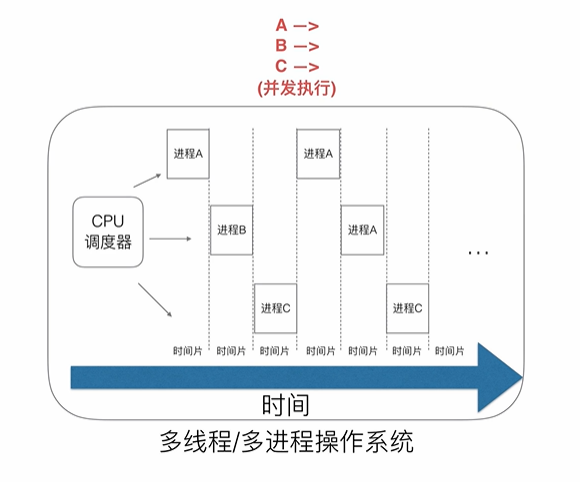
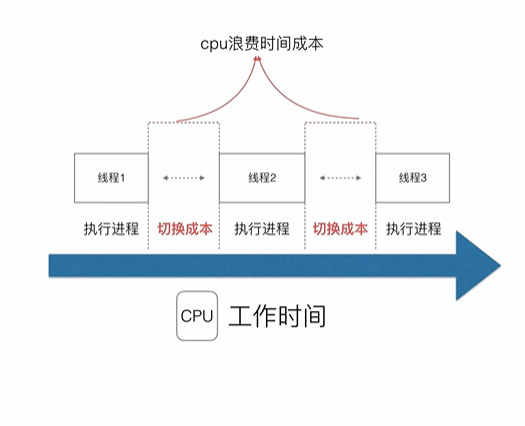
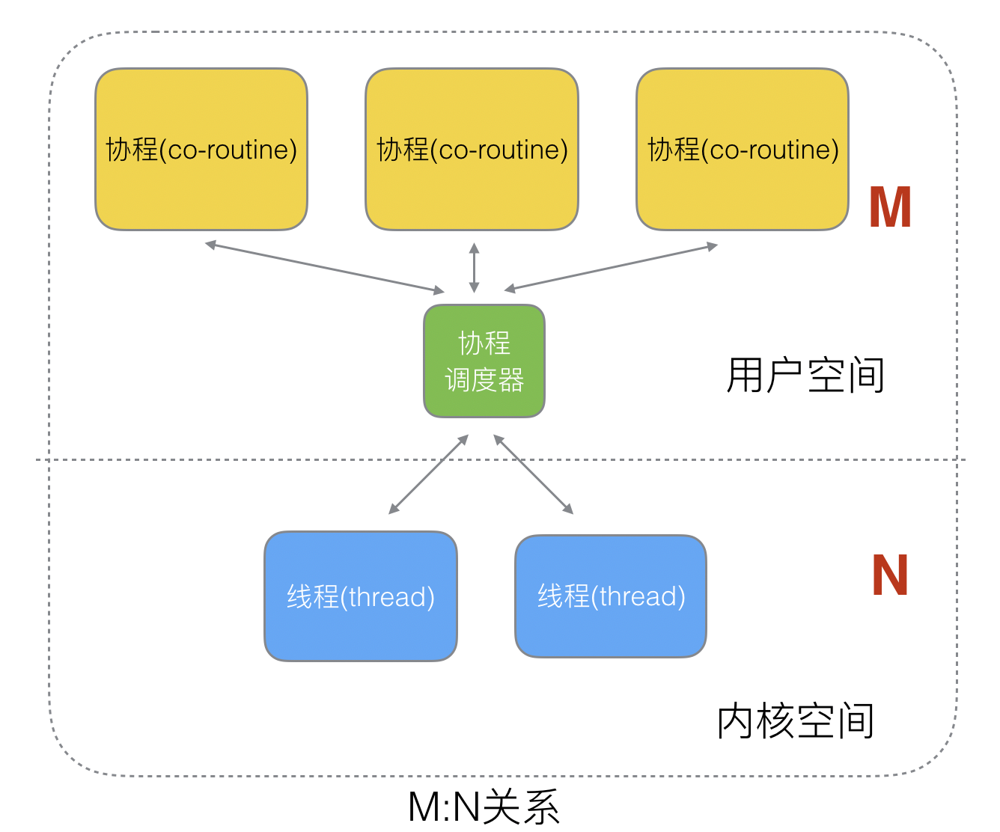

# 深入理解GPM模型
## 调度器的由来
### 1.单进程
早期的操作系统只支持单进程，所谓单进程是指 单一执行流程，CPU一个一个去处理任务。在大量io的场景下，CPU会因为某个进程的IO而被阻塞，同时又无法执行其他进程，造成浪费CPU性能。
### 2.多进程/多线程
引入一个CPU调度器，给CPU划分时间片，不同进程只能执行时间片内的时长，当进程执行满时间片长度，调度器将会强制停止该进程，开始执行下一个任务。这就是所谓的并发执行，解决了单进程出现的阻塞问题。

但是，这种调度方式，不同时间片的进程切换之间存在切换成本。进程/线程越多，切换的成本也越大，造成的CPU的浪费也越多。高并发的场景下，浪费的时间可能不亚于单进程的阻塞。

此外 大量的线程/进程会占用大量资源
- 高内存占用
- 高CPU调度资源

### 3.协程
一个线程，我们可以拆分成一个内核空间和一个用户空间，内核空间主要（内核线程）主要解决资源调配的问题，而用户空间（用户线程）解决业务逻辑。两者必须呈绑定关系。

由于多线程会因为高并发场景下切换线程导致的资源浪费，我们可以在一个线程内的用户线程进行拆分，拆分的用户线程被称作协程(co-routine)。

协程和线程有一下几种关系：
- N : 1
N 个协程绑定 1 个线程
    - 优点：
        - 协程在用户线程中切换，不会影响内核，因此这种切换会很快
    - 缺点
        - 无法利用多个CPU
        - 一个协程阻塞会造成线程阻塞，本线程的其他协程都会阻塞。

- 1 : 1

和直接使用线程没多大区别。

- M : N

是上述两种模型的结合，实现复杂，但克服了另两种的缺点。

## Golang 的协程
- 轻量（几KB） => 大量并发
- 调度灵活（runtime） => 切换迅速

### 旧版的调度器

M 是线程， G 是协程。

M 每次执行，放回 G 都需要访问全局队列，且 M 有多个，所以多线程访问同一资源需要加锁保证 互斥/同步， 全局队列是有互斥锁进行保护。

- 缺点
    - 创建、销毁、调度需要每个M获取锁，这会导致锁竞争
    - M 转移 G 会造成延迟以及额外的系统负载。
        - 当 M1 上运行的一个 G 创建了一个新 G' , 为了保证并发， G' 会转移到 M1。 这会造成局部性（即G 和 G'如果需要互相访问对方的资源，需要进行额外的资源读取，因为M0, M1是两个线程）
    - 系统调用（CPU在M之间的切换）导致线程的阻塞，取消阻塞。这还是会增加系统开销。