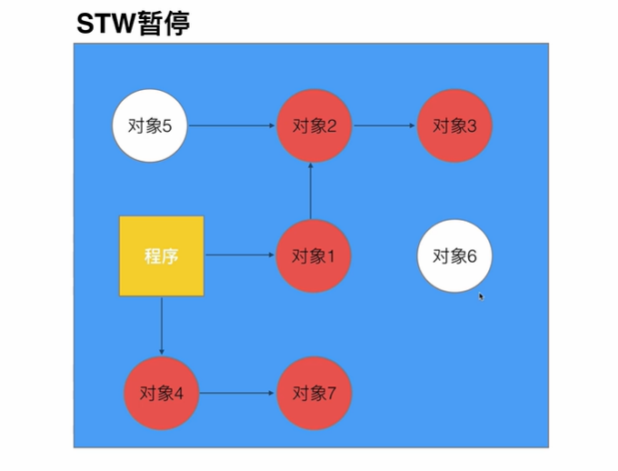

# golang 的GC
- 垃圾回收
- 内存管理
- 自动释放
- 三色标记法
- STW(stop the world)
## （一） 标记清除法 (golang v1.3)
1. STW，暂停程序业务逻辑， 找到可达对象和不可达对象
2. 标记可达对象
3. 清除不可达对象
4. 程序恢复

循环以上过程，直到程序生命周期结束

- 缺点
    - STW 暂停程序，出现卡顿 (严重)
        - 后期将 `sweep清除` 移出STW 暂停范围
    - 需要扫描整个heap
    - 清除数据会产生heap碎片。
## （二）三色标记（golang v1.4）

1. 程序开始创建的对象均标记为白色。
2. 每次GC开始时，从根节点遍历所有对象，把遍历到的对象从白色集合转移到灰色集合。
3. 遍历灰色集合，将灰色集合中的对象所引用的对象从白色集合放入灰色集合，并将此灰色对象移入黑色对象。
4. 重复上述步骤，直至灰色列表中没有任何对象。
5. 回收所有的白色列表中的对象。

- 三色标记法会出现的严重问题
    - 条件1 黑色对象引用了一个白色对象。
    - 条件2 同时，该白色对象原本可由其他灰色对象引用，但该引用遭到了破坏。

    - 满足以上两个条件，会导致一个不是垃圾的白色对象，因为被黑色对象引用，无法转成灰色对象，最后被回收，这就叫做 `对象丢失`

### 三色不变式
- 强三色不变式
    - 强制性不允许黑色对象引用白色对象 （ 破坏条件1）
- 弱三色不变式
    - 黑色可以引用白色对象，但该白色对象必须存在一个灰色对象引用它(或该白色对象必须是可达对象) （破坏条件2

## (三) 屏障机制

### 什么叫屏障
屏障是一个额外的判断机制

类似下面三种概念
- Hook
- 回调
- handler

- 插入机制
    - 对象被引用时触发的机制
- 删除屏障
    - 对象被删除时触发的机制

### 插入屏障 （不用于栈）
- 在A对象引用B对象时，B对象被标记为灰色。（满足：强三色不变式）
- 不足： 因为不希望插入写屏障影响栈空间的效率，它不会应用于栈空间。因此，为了避免栈空间出现 `对象丢失`，我们在结束时（回收对象前）STW并扫描栈空间，这需要花费10 - 100 ms

### 删除屏障
- 被删除的对象，如果自身为灰色或者白色，都标记为灰色。
（换句话说，当要断开一个灰色对象引用一个白色对象之间的通路时，将该白色对象变灰，避免当其他黑色对象引用这个白色对象时，因为灰色对象的断开导致这个白色对象 `对象丢失`）
- 不足：
    - 回收精度低，当灰色对象和白色对象断开引用时，该应该被删除的白色对象在这轮GC时最终被标记为黑色，活过了这轮GC

### 