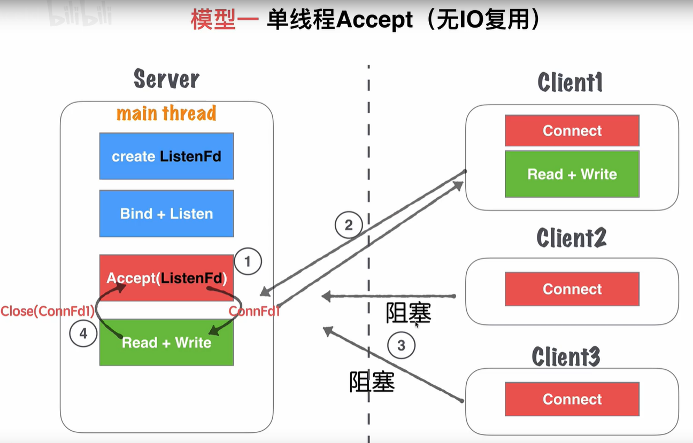
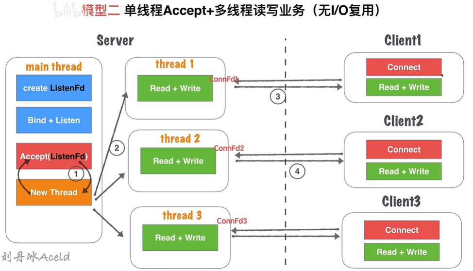
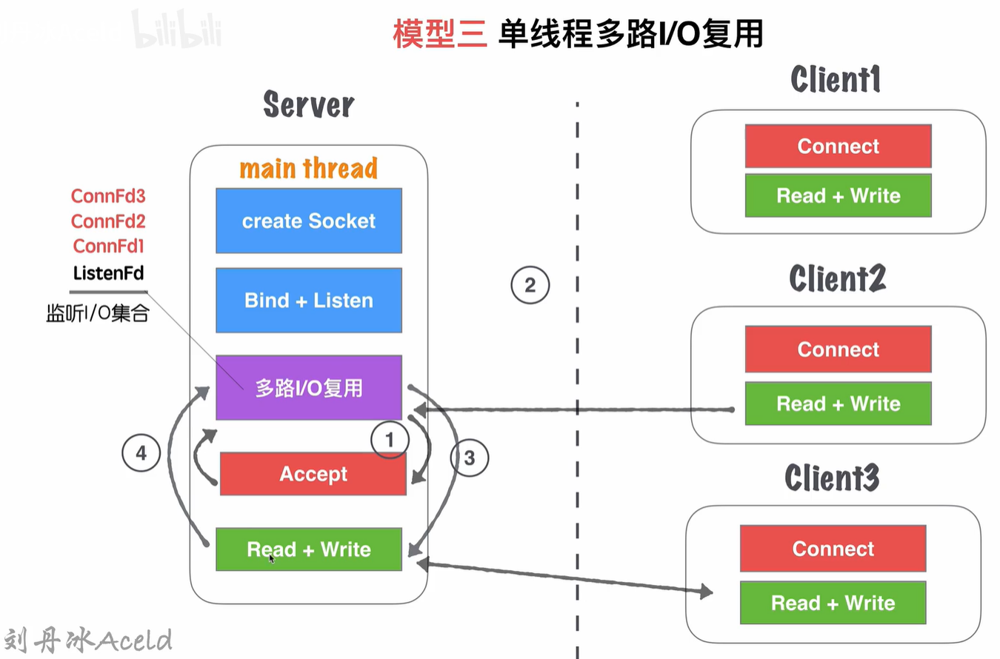
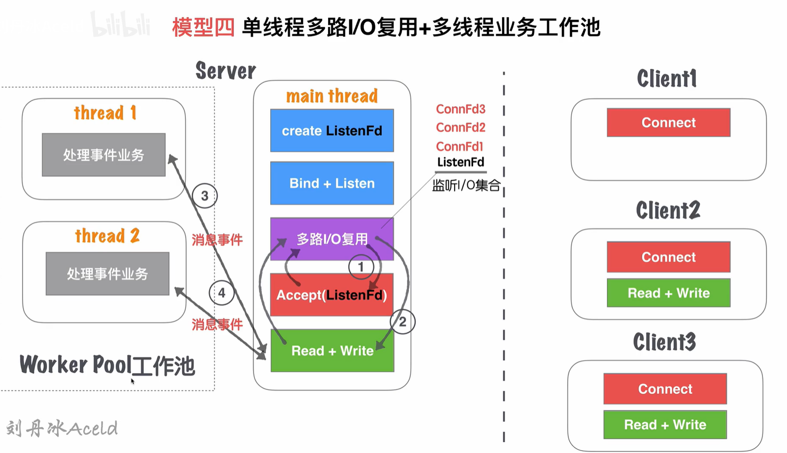

# Linux 中网络I/O复用并发模型

## 什么是阻塞，非阻塞，IO多路复用？
- 流
    - 可进行I/O操作的内核对象
        - 文字
        - 管道
        - 套接字
    - 流的入口：文件描述符(fd)

- 阻塞等待
不占用CPU时间片

    - 缺点
        - 不能处理多个I/O请求的问题
        - 同一个阻塞，同一时间只能处理一个流的阻塞监听
- 非阻塞（忙轮询）
占用资源不断去查看资源锁有没有释放

- 多路IO复用
既能阻塞等待，不浪费资源，又能同一时刻监听多个IO请求的状态

## IO复用解决的问题
如何解决大量IO读写问题
- 忙轮询
```
while true {
	for i in 流[] {
		if i has 数据 {
			读 或者 其他处理
		}
	}
}
```
同时和多个流访问。

- select
```
while true {
	select(流[]); //阻塞

  //有消息抵达
	for i in 流[] {
		if i has 数据 {
			读 或者 其他处理
		}
	}
}
```
select负责接收IO，但不能精准直到哪些IO可用，还需要遍历。监听的IO有限，一般1024个，与平台无关

- epoll
```
while true {
	可处理的流[] = epoll_wait(epoll_fd); //阻塞

  //有消息抵达，全部放在 “可处理的流[]”中
	for i in 可处理的流[] {
		读 或者 其他处理
	}
}
```
类似select,但能返回所有可以处理的流，不必再去遍历确认

## epoll是什么
- linux独有
- 一种I/O 多路复用技术
- 只关心活跃的链接，无需遍历所有的描述符集合。
- 能处理大量链接请求（系统可以打开的文件数目 `cat /proc/sys/fs/file-max`）

## API
1. 创建
```
/** 
 * @param size 告诉内核监听的数目 
 * 
 * @returns 返回一个epoll句柄（即一个文件描述符） 
 */
int epoll_create(int size);
```
2. 控制
```
/**
* @param epfd 用epoll_create所创建的epoll句柄
* @param op 表示对epoll监控描述符控制的动作
*
* EPOLL_CTL_ADD(注册新的fd到epfd)
* EPOLL_CTL_MOD(修改已经注册的fd的监听事件)
* EPOLL_CTL_DEL(epfd删除一个fd)
*
* @param fd 需要监听的文件描述符
* @param event 告诉内核需要监听的事件
*
* @returns 成功返回0，失败返回-1, errno查看错误信息
*/
int epoll_ctl(int epfd, int op, int fd,
struct epoll_event *event);


struct epoll_event {
	__uint32_t events; /* epoll 事件 */
	epoll_data_t data; /* 用户传递的数据 */
}

/*
 * events : {EPOLLIN, EPOLLOUT, EPOLLPRI,
						 EPOLLHUP, EPOLLET, EPOLLONESHOT}
 */
typedef union epoll_data {
	void *ptr;
	int fd;
	uint32_t u32;
	uint64_t u64;
} epoll_data_t;
```
3. 等待
```
/**
*
* @param epfd 用epoll_create所创建的epoll句柄
* @param event 从内核得到的事件集合
* @param maxevents 告知内核这个events有多大,
* 注意: 值 不能大于创建epoll_create()时的size.
* @param timeout 超时时间
* -1: 永久阻塞
* 0: 立即返回，非阻塞
* >0: 指定微秒
*
* @returns 成功: 有多少文件描述符就绪,时间到时返回0
* 失败: -1, errno 查看错误
*/
int epoll_wait(int epfd, struct epoll_event *event,
							 int maxevents, int timeout);
```
### epoll 基本编程架构
```
int epfd = epoll_crete(1000);

//将 listen_fd 添加进 epoll 中
epoll_ctl(epfd, EPOLL_CTL_ADD, listen_fd,&listen_event);

while (1) {
	//阻塞等待 epoll 中 的fd 触发
	int active_cnt = epoll_wait(epfd, events, 1000, -1);

	for (i = 0 ; i < active_cnt; i++) {
		if (evnets[i].data.fd == listen_fd) {
			//accept. 并且将新accept 的fd 加进epoll中.
		}
		else if (events[i].events & EPOLLIN) {
			//对此fd 进行读操作
		}
		else if (events[i].events & EPOLLOUT) {
			//对此fd 进行写操作
		}
	}
}
```

## 常见模型

### 单线程Accept

- 主线程的 `Accept（ListenFd）` 会阻塞主线程
- 连接成功后，会在服务端生成一个连接的套接字
- 一次只能形成一个连接，另一个客户端如果尝试连接，会阻塞
- 处理完当前客户端，并关闭套接字文件，再去处理下一个客户端

### 单线程Accept + 多线程读写业务 (无I/O复用)

- `Accept(ListenFd)` 监听客户端请求，阻塞主线程
- 接收客户端请求后，开辟一个新线程，进行读写业务。
- 主线程继续监听，能处理其他客户端的请求

这个模型虽然支持了并发，但是：
- 高并发情况下，多线程加重服务器负担
- 长连接的场景，客户端没有读写业务，但它不关闭，就需要不断进行心跳检测，占用了资源。

### 单线程多路I/O复用

- 主线程创建 `listenFd`， 采用多路I/O服用机制，进行IO状态阻塞监控。当client1发送请求，检测到了 `listenFd` 触发读时间，运行 accept 建立连接，并将 `connFd1`加入监听集合。
- client1进行读写请求时，多路IO复用机制的监听阻塞释放，并触发套接字读写事件
- client1触发的读写业务会使主线程阻塞，无法处理新的客户端的请求。

该模型可以监听多个客户端的读写状态。且发生阻塞，处于非忙轮询的状态，不浪费CPU资源

**缺点**：
- 能同时监听，但不能同时处理多个客户端的读写请求
- 不支持高并发场景

## 单线程多路I/O复用 + 多线程业务工作池

该场景使用比较少


- 主线程采用多路I/O复用机制监听连接请求。当监听到客户端连接请求后，处理连接请求，并将生成的`connFd1`加入到监听集合中
- 当监听到读写事件，则进行读写消息的处理
- 主线程处理读写消息，将业务逻辑交给工作线程池处理。工作线程池在server启动前开启的一定数量的线程。他们只处理逻辑业务，不处理套接字读写操作。
- 工作线程池处理完业务，再触发`connFd1`的写事件，将回执消息返回给对方

优点：
	- 将业务处理分离出来，缩短客户端的等待时间。
	- 能并发处理客户端业务。

缺点：
	- 读写处理仍然需要单独处理。(排队)
	- 业务处理后的结果，也需要按顺序返回给客户端。（排队）
